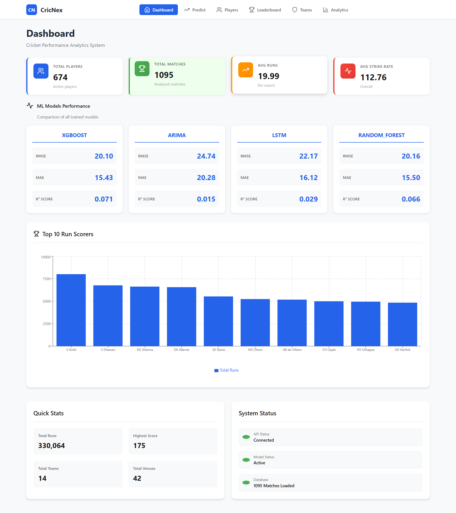
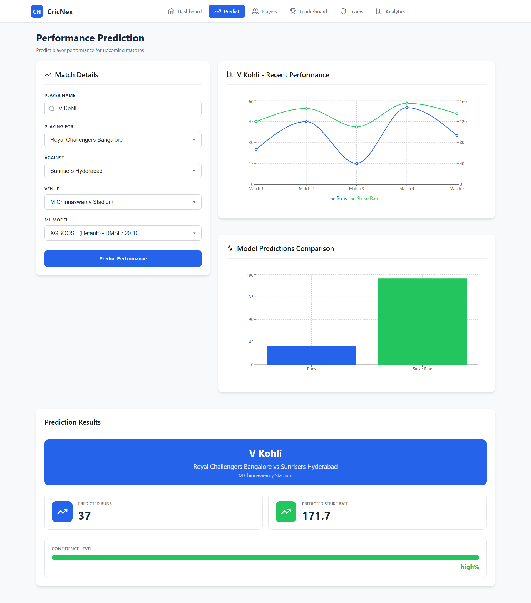
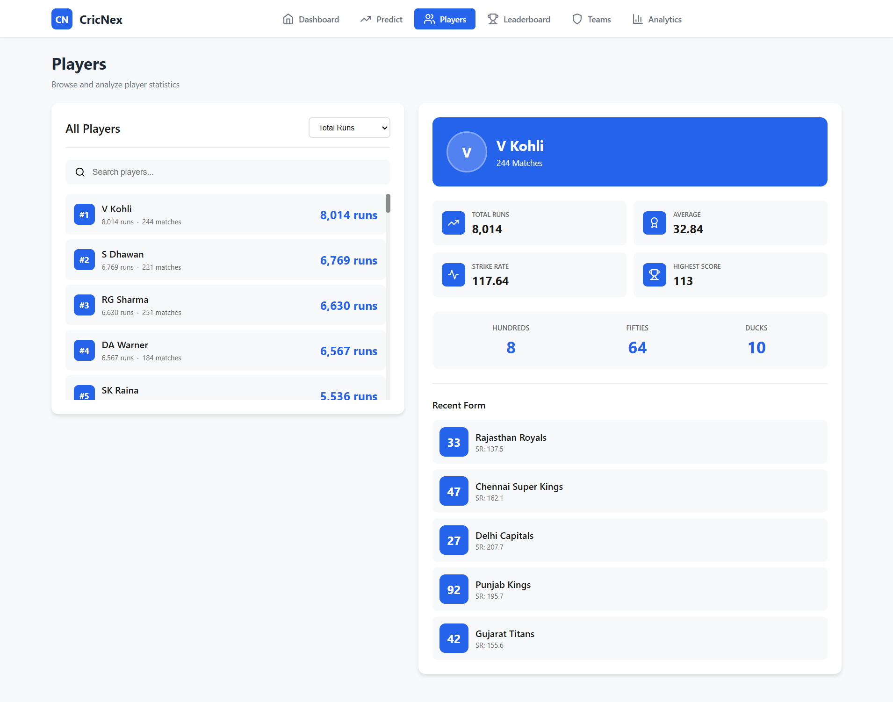
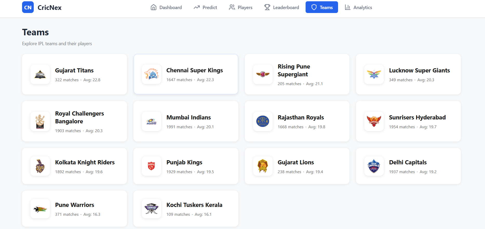
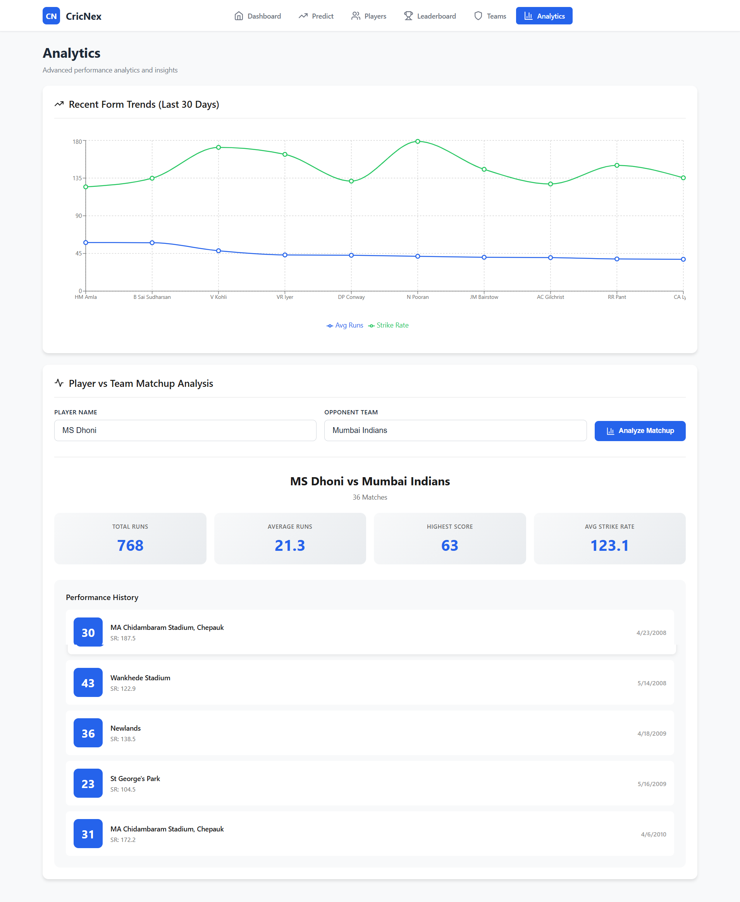

# 🏏 CricNex — IPL Player Performance Prediction System

CricNex is a full-stack machine learning application that predicts IPL cricket player performance using historical ball-by-ball data. It features a Flask REST API backend powered by multiple ML models and a React dashboard frontend.

---

## 📸 Screenshots

### Dashboard


### Player Prediction


### Players Explorer


### Teams


### Analytics


---

## 🚀 Features

- **Multi-model Prediction** — XGBoost, Random Forest, LSTM, ARIMA models with switchable selection
- **Player Search & Stats** — Detailed career and recent-form statistics for every IPL player
- **Team Analytics** — Team-wise performance breakdowns and comparisons
- **Leaderboard** — Top run scorers, strike rates, and batting averages
- **Player Comparison** — Side-by-side comparison of multiple players
- **Recent Form Tracker** — Rolling form analysis across the last N matches
- **Venue-aware Predictions** — Factors in venue-specific performance history
- **MongoDB Integration** — Stores prediction history and player analytics

---

## 🛠️ Tech Stack

| Layer | Technology |
|-------|-----------|
| Frontend | React 18, Recharts, Axios, React Router v6 |
| Backend | Python 3.10, Flask, Flask-CORS |
| ML Models | XGBoost, Random Forest, LSTM (TensorFlow/Keras), ARIMA |
| Database | MongoDB (via PyMongo) |
| Data | IPL ball-by-ball data up to 2024 |
| Deployment | Render (backend) + Vercel (frontend) |

---

## 📁 Project Structure

```
CRICNEX/
├── src/
│   ├── backend.py          # Flask REST API (all endpoints)
│   ├── wsgi.py             # Gunicorn entry point for production
│   ├── main.py             # ML pipeline orchestrator
│   ├── data_loader.py      # Data ingestion & aggregation
│   ├── feature_engineering.py  # Feature construction
│   ├── model_training.py   # Model training & evaluation
│   ├── mongo_handler.py    # MongoDB read/write operations
│   └── api.py              # API helpers
├── frontend/
│   ├── src/
│   │   ├── pages/          # Dashboard, Prediction, Players, Teams, Analytics, Leaderboard
│   │   ├── components/     # StatCard, Layout
│   │   └── services/api.js # Axios API client
│   └── package.json
├── models/                 # Trained .pkl model files
├── data/                   # Processed features CSV
├── ballbyball/             # Raw IPL dataset (not tracked in git)
├── render.yaml             # Render deployment config
└── vercel.json             # Vercel deployment config
```

---

## ⚙️ Local Setup

### Prerequisites
- Python 3.10+
- Node.js 18+
- MongoDB (local or Atlas)

### 1. Clone the repository
```bash
git clone https://github.com/PrajwalStudio/cricnex-player-analytics-framework.git
cd cricnex-player-analytics-framework
```

### 2. Backend
```bash
pip install -r requirements.txt
cd src
python wsgi.py
# API runs on http://localhost:5000
```

### 3. Frontend
```bash
cd frontend
npm install
npm start
# UI runs on http://localhost:3000
```

### 4. Environment Variables (optional)
| Variable | Default | Description |
|----------|---------|-------------|
| `MONGODB_URI` | `mongodb://localhost:27017/` | MongoDB connection string |
| `REACT_APP_API_URL` | `http://localhost:5000/api` | Backend API base URL |

---

## 🌐 API Endpoints

| Method | Endpoint | Description |
|--------|----------|-------------|
| GET | `/api/health` | Health check |
| GET | `/api/stats/summary` | Overall dataset stats |
| POST | `/api/predict` | Predict player performance |
| POST | `/api/predict/batch` | Batch predictions |
| GET | `/api/players` | List all players |
| GET | `/api/players/search?q=` | Search players |
| GET | `/api/players/:name` | Player details |
| GET | `/api/teams` | List all teams |
| GET | `/api/teams/:name/players` | Players in a team |
| GET | `/api/venues` | List all venues |
| GET | `/api/leaderboard/runs` | Top run scorers |
| GET | `/api/leaderboard/strike-rate` | Top strike rates |
| GET | `/api/leaderboard/average` | Top batting averages |
| POST | `/api/compare/players` | Compare multiple players |
| GET | `/api/analytics/form` | Recent form data |
| GET | `/api/analytics/matchups` | Player vs team matchups |
| GET | `/api/models` | Available ML models |

---

## 📊 ML Models

| Model | Description |
|-------|-------------|
| **XGBoost** | Gradient boosting — primary prediction model |
| **Random Forest** | Ensemble tree model |
| **LSTM** | Deep learning sequence model for form trends |
| **ARIMA** | Time-series model for run-rate forecasting |

---

## 🚀 Deployment

### Backend → [Render](https://render.com)
1. Connect GitHub repo on Render
2. It auto-detects `render.yaml` and deploys via Gunicorn
3. Set `MONGODB_URI` in Render environment variables

### Frontend → [Vercel](https://vercel.com)
1. Import the GitHub repo on Vercel
2. It auto-detects `vercel.json`
3. Set `REACT_APP_API_URL` to your Render backend URL

### Database → [MongoDB Atlas](https://mongodb.com/atlas)
Free 512MB cluster — sufficient for prediction history and player analytics.

---

## 📄 License

MIT License © 2024 PrajwalStudio
